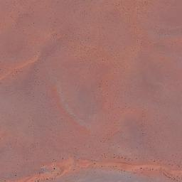
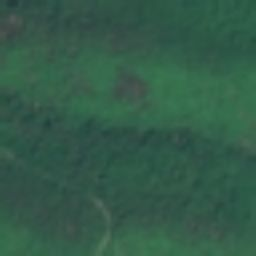
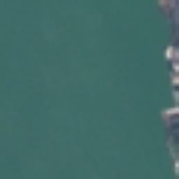

# Satellite Image Classification

## Problem Description

This project addresses the problem of **satellite image classification**, where the goal is to automatically classify satellite images into predefined classes (**cloudy**, **desert**, **green_area**, **water**) based on visual content.

Satellite image classification is a fundamental task in remote sensing and is widely used in:
- environmental monitoring
- urban planning
- agriculture analysis
- disaster assessment

**Real-world usage example:**  
The model can be used by government agencies and private companies to automatically analyze satellite imagery for monitoring land use changes, detecting urban expansion, and assessing environmental impact.

The task is formulated as a **multi-class image classification** problem. A convolutional neural network (CNN) is trained to learn discriminative visual patterns from satellite imagery and predict the correct class label for unseen images.

---

## Dataset Description with Fields and Classes

The project uses the **[Satellite Image Classification](https://www.kaggle.com/datasets/mahmoudreda55/satellite-image-classification)** dataset from Kaggle (published by Mahmoud Reda).  
The dataset consists of satellite images organized in a **folder-based structure**, where each subdirectory represents a single class. This structure is fully compatible with `torchvision.datasets.ImageFolder`.

Directory structure:

```text
data/
├── cloudy/
├── desert/
├── green_area/
└── water/
```
### Sample Images from the Dataset

Below are example satellite images for each class in the dataset.

| Cloudy | Desert |
|--------|--------|
|  |  |

| Green Area | Water |
|------------|-------|
|  |  |

### Classes

The dataset contains four classes:

| Class name | Description |
|-----------|-------------|
| **cloudy** | Satellite images dominated by cloud cover. This class represents scenes where clouds obscure the Earth’s surface, which is a common challenge in satellite image analysis and remote sensing. |
| **desert** | Images of arid and semi-arid regions with sandy terrain and minimal vegetation. These images are important for identifying barren land and monitoring desertification. |
| **green_area** | Images characterized by dense vegetation such as forests, grasslands, and agricultural fields. This class is essential for environmental monitoring, agriculture, and ecosystem analysis. |
| **water** | Images containing large water bodies such as rivers, lakes, or seas. This class supports applications related to hydrology, flood monitoring, and water resource management. |

### Target Variable

- **Target name:** `target`  
- **Type:** Categorical  
- **Task:** Multi-class image classification  
- **Description:** The model predicts the category of a satellite image, selecting one of the four classes listed above.

### Class Distribution

The dataset contains approximately **5,600 images** in total and is moderately imbalanced:

- **cloudy:** ~1,500 images  
- **desert:** ~1,100 images  
- **green_area:** ~1,500 images  
- **water:** ~1,500 images  

---

## Directory Structure

```text
.
├── README.md
├── data/
│   ├── cloudy/
│   ├── desert/
│   ├── green_area/    
│   └── water/
├── images/
├── notebooks/
│   └── classification.ipynb 
├── src/
│   └── predict.py
├── app/
│   └── main.py
├── model/
│   └── model.pth
├── Dockerfile
├── pyproject.toml
└── uv.lock
```

---

## Exploratory Data Analysis (EDA)

Exploratory Data Analysis was performed in [`notebooks/classification.ipynb`](https://github.com/bogdan-kovalchuk/Satellite-Terrain-Classifier/blob/main/notebooks/classification.ipynb) to understand the structure and characteristics of the satellite image dataset before model training.

The following steps were carried out:

### Dataset Size and Class Distribution

- The dataset was loaded in its original form (without transformations) using `torchvision.datasets.ImageFolder`.
- The total number of images and the list of available classes were inspected.
- The number of images per class was calculated to analyze class balance.
- A bar chart was created to visualize the class distribution.
- An imbalance ratio (max class size / min class size) was computed.

**Observation:**  
The dataset is **moderately imbalanced**, with the `desert` class containing fewer samples compared to the other classes. This imbalance was considered during model training.

---

### Visualization of Sample Images per Class

- One representative image was randomly selected and visualized for each class.
- Images were displayed in a 2×2 grid to allow visual comparison between classes.

**Observation:**  
- `cloudy` images often have reduced surface detail due to cloud coverage.  
- `water` images are characterized by smooth textures and dominant blue tones.  
- `green_area` images show vegetation patterns and high texture variability.  
- `desert` images typically contain sandy or brown tones with granular textures.

These visual differences indicate that the classes are visually distinguishable, making the dataset suitable for image classification.

---

### Image Resolution and Channel Analysis

- A subset of images was sampled to analyze original image resolutions.
- Width and height distributions were inspected using a scatter plot.
- Mean and standard deviation values were computed for each RGB channel.

**Observation:**  
- Original image resolutions vary across the dataset.
- All images are RGB (3-channel).
- Due to varying resolutions, resizing images to a fixed size (64×64) is necessary for consistent model input.

---

## Model Training

### Model Architecture

The model used in this project is a custom **ResNet9** convolutional neural network designed for image classification tasks with relatively small input sizes (64×64).

The architecture consists of:
- Convolutional blocks with **Conv2D + Batch Normalization + ReLU**
- Two residual connections to improve gradient flow
- MaxPooling layers for spatial downsampling
- Global average pooling followed by a fully connected classification head
- Dropout regularization in the final layer to reduce overfitting

The network takes RGB images as input and outputs class probabilities for the four land-cover classes.

---

### Training Setup

- **Optimizer:** Adam  
- **Loss function:** Cross-Entropy Loss  
- **Learning rate:** `1e-3`  
- **Weight decay:** `1e-4`  
- **Number of epochs:** `10`  
- **Batch size:** `32`  
- **Validation split:** `20%` of the dataset  
- **Random seed:** `42` (for reproducibility)

The model is trained using mini-batch gradient descent. During training, performance is evaluated after each epoch on a held-out validation set.

---

### Training Process

For each epoch:
1. The model is trained on the training subset.
2. Training loss and accuracy are computed.
3. The model is evaluated on the validation subset.
4. Validation loss and accuracy are reported.

This allows monitoring both learning progress and generalization performance throughout training.

---

### Training Results

The model demonstrates strong performance on the validation set, achieving a **validation accuracy of approximately 96–97% at its best epoch**, indicating good generalization for the satellite image classification task.

---

### Model Saving

After training, the final model is saved to disk for later inference and deployment:

```text
model/model.pth
```

---

## Reproducibility

The project is fully reproducible.

Reproducibility is ensured by:
- Fixing random seeds to guarantee consistent data splits and training behavior across runs
- Using a well-defined and publicly available dataset with a stable directory structure
- Keeping the full training and inference logic in standalone scripts without external dependencies on runtime state
- Applying deterministic preprocessing steps, including fixed image resizing and consistent data transformations
- Saving trained model artifacts along with class labels and input configuration parameters

These design choices ensure that the results reported in this project can be reliably reproduced under the same software and hardware conditions.

---

## Dependency and Environment Management

All dependencies for this project are managed using **uv**. The [`pyproject.toml`](https://github.com/bogdan-kovalchuk/Satellite-Terrain-Classifier/blob/main/pyproject.toml) file defines the complete list of required Python packages and their versions.

### Main Libraries

The application relies on the following core technologies:

- **torch** – neural network framework for training and inference  
- **torchvision** – image processing utilities and datasets  
- **fastapi** – REST API framework  
- **uvicorn** – ASGI server for running FastAPI applications  
- **numpy** – numerical operations  
- **python-multipart** – file upload support in FastAPI

---

### Environment Setup

To create a fully configured and reproducible environment, execute from the root directory:

```bash
uv sync
```

This command automatically creates a virtual environment and installs all packages specified in [`pyproject.toml`](https://github.com/bogdan-kovalchuk/Satellite-Terrain-Classifier/blob/main/pyproject.toml).

---

## Model Deployment ([FastAPI](https://fastapi.tiangolo.com/))

The trained model is deployed as a REST API using **FastAPI**. The service supports two prediction modes: direct image file upload and JSON base64 input.

### Running the Service Locally

The API is executed through the uv environment:

```bash
uv run uvicorn app.main:app --host 0.0.0.0 --port 8000
```

---

### Image Classification via File Upload

```bash
curl -X POST http://localhost:8000/predict-file \
     -F "file=@images/test_cloudy.jpg" \
     -w "\n"
```

---

### Image Classification via Base64

```bash
curl -X POST http://localhost:8000/predict-base64 \
     -H "Content-Type: application/json" \
     -d '{"image": "<base64-encoded-image>"}' \
     -w "\n"
```

Example output:
```bash
{
  "predicted_class": "water",
  "probabilities": {
    "cloudy": 0.0124,
    "desert": 0.0011,
    "green_area": 0.0347,
    "water": 0.9518
  }
}
```

---

## Containerization

All components of the project are containerized using Docker. The container runs the FastAPI application with the trained PyTorch model.

### Dockerfile

The [`Dockerfile`](https://github.com/bogdan-kovalchuk/Satellite-Terrain-Classifier/blob/main/Dockerfile) used in this project is available in the repository root.

The file contains instructions for installing all required packages, copying `app/main.py` and `src/predict.py`, and running the FastAPI service.

---

### Building Docker Image

From the repository root execute:

```bash
docker build -t predict:latest .
```

### Running Docker Container

```bash
docker run -it --rm -p 9696:8000 predict:latest
```

The option `-p 9696:8000` maps the internal container port to the port on the host machine, enabling access to the API.

The container launches the application using uvicorn as described earlier. 

---

### API Testing

To classify an image file using the API:

```bash
curl -X POST http://localhost:9696/predict-file \
     -F "file=@images/test_cloudy.jpg" \
     -w "\n"
```

To classify an image via base64 JSON input:

```bash
curl -X POST http://localhost:9696/predict-base64 \
     -H "Content-Type: application/json" \
     -d '{"image": "<base64-encoded-image>"}' \
     -w "\n"
```

---

## Cloud Deployment (AWS Deployment)

The service is deployed on **AWS EC2** using Docker.

Deployment steps:
1. Launch EC2 instance
2. Install Docker
3. Clone repository
4. Build Docker image
5. Run container

The service is accessible at:

```text
http://<EC2_PUBLIC_IP>:8000
```

**TODO:**
- Add EC2 instance type
- Add security group configuration
- Add screenshots or video of deployed service

---

## Conclusion

This project demonstrates an end-to-end deep learning pipeline for satellite image classification, including:
- Data exploration
- Model training
- API deployment
- Containerization
- Cloud deployment

The solution is designed to be reproducible, extensible, and production-ready.

